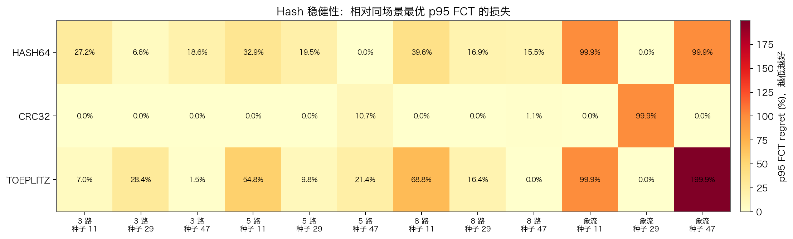
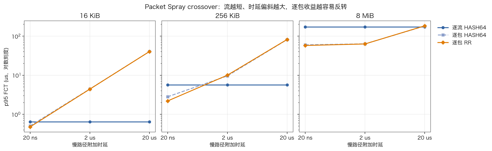
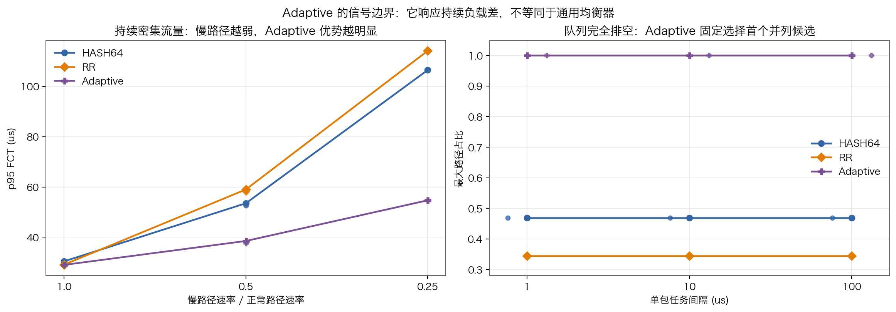
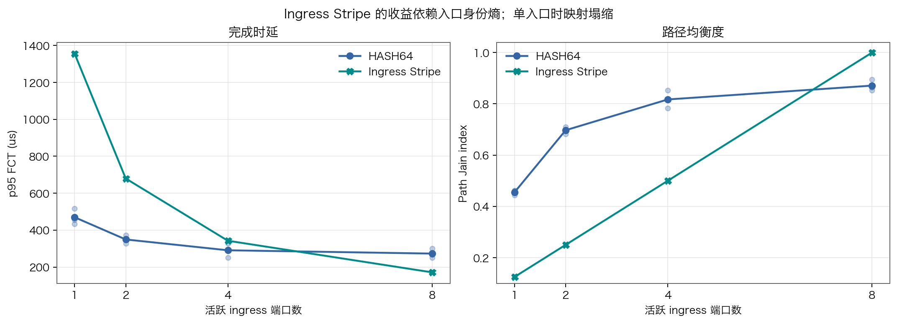
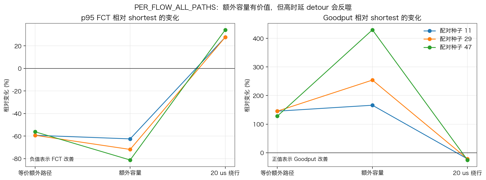
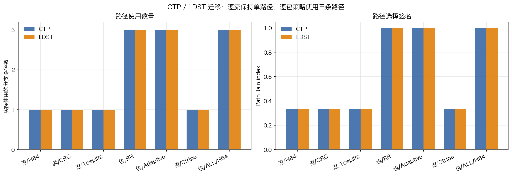

# OpenUSim 路由策略适用性实验报告

## 结论摘要

本实验已经满足当前“为不同网络场景选择路由策略”的使用需求。主矩阵与补充矩阵共
197 个 case 全部成功完成，其中 193 个与预注册预测一致，4 个部分一致；没有失败、
跳过、不一致或证据不足的 case。

实验不支持“某一种策略全局最优”。更准确的选择规则是：

- 一般场景先用 `PER_FLOW_SHORTEST_PATHS + HASH64`，把它视为保守基线，而不是全局冠军。
- 对称等价路径上的长流，优先验证 `PER_PACKET_SHORTEST_PATHS + ROUND_ROBIN`。
- 短流或存在明显路径时延偏斜时，优先保持逐流路径亲和性。
- 存在持续队列差或路径速率不等时，`ADAPTIVE` 才有稳定信号；队列排空后它会集中到
  第一个并列候选，而不是自动均匀分散。
- `INGRESS_PORT_STRIPE` 只有在 ingress 身份足够多样时才有优势。
- `ALL_PATHS` 只应纳入确实有价值的额外容量；高时延 detour 会把容量收益反转成 FCT
  损失。

## 实验设计与证据边界

主矩阵包含 152 个 case，覆盖 Hash 稳健性、Packet Spray crossover、Adaptive 信号、
Ingress Stripe、候选路径范围以及 CTP/LDST 迁移。补充矩阵包含 45 个 case，专门修补
两个有效性缺口：单包且队列完全排空的 Adaptive 行为，以及具有独立流 key 的逐流
`ALL_PATHS` 行为。

| 实验块 | case 数 | 核心自变量 | 主要观察量 |
|---|---:|---|---|
| Hash 稳健性 | 36 | 3/5/8 路、3 个 key seed、象流 key | p95 FCT、Path Jain、最大路径占比 |
| Packet Spray | 27 | 16 KiB/256 KiB/8 MiB、20 ns/2 us/20 us | p95/p99 FCT、goodput、PSN inversion |
| Adaptive 信号 | 27 | 1/1、1/2、1/4 路径速率、dense/sparse | p95 FCT、慢路径占比、队列占用 |
| Ingress 熵 | 24 | 1/2/4/8 个 ingress、3 个 pairing seed | p95 FCT、Path Jain |
| 路径范围 | 24 | shortest/all、容量与时延 detour | p95 FCT、goodput、detour 占比 |
| CTP/LDST 迁移 | 14 | 7 个合法 profile、2 个 transport | 完成状态、路径选择签名 |
| Adaptive 单包补充 | 27 | 1/10/100 us gap、3 档路径速率 | 空队列比例、最大路径占比 |
| 独立流 key 的 ALL_PATHS 补充 | 18 | 3 个 detour regime、3 个 pairing seed | p95 FCT、goodput、路径使用 |

证据标签如下：

- **measured**：`output/task_statistics.csv` 给出的任务完成时延与任务级吞吐。
- **trace-derived**：从分支端口与队列 trace 计算的路径包/字节数、Path Jain、最大路径
  占比、detour/slow-path 占比和队列占用。
- **proxy**：PSN adjacent inversion 只表示相邻到达次序反转，不能当作精确乱序深度、
  重传次数或重传率。
- **case-derived**：拓扑、路径宽度、时延、速率、flow size、arrival gap 等来自 case 输入。

所有 case 串行运行，使用 release build、CBFC、按需 transport channel；拥塞控制和重传
关闭。两个 run ledger 均记录模拟器源码提交为
`d369f91df7d3ee78993ff812e1be3efbb2c02af9`。

## 结果分析

### 1. Hash 没有跨场景的固定赢家



图的用途是检查每种 Hash 相对同一个场景 cell 内最优 p95 FCT 的损失；横轴是候选路径
宽度与 traffic-key seed，最后三列为 4 个象流的 key seed，纵轴是 selector，颜色和格内
数值都是 relative regret，越低越好。数据源为主矩阵 `hash-robustness` 的 36 行 measured
p95 FCT。

CRC32 在 12 个 cell 中 9 次达到 cell 最小值，平均 regret 为 9.3%，但在一个象流 seed
上仍接近 100% regret。HASH64 与 TOEPLITZ 也分别在特定 cell 达到最优，TOEPLITZ 的最坏
regret 达到约 200%。这说明真实选择取决于候选宽度和部署 key 分布。HASH64 可继续作为
实现默认基线，但不能依据本矩阵宣称它或 CRC32 是全局最优。

### 2. Packet Spray 存在明确 crossover



图按 flow size 分成 3 个 panel；横轴是慢候选的附加时延，纵轴是 measured p95 FCT，采用
对数刻度。每个点对应一个 case，不做跨 case 平均。

- 8 MiB、等时延路径：逐流 HASH64 约 171.4 us，逐包 HASH64 与 RR 分别约 59.9 us 和
  57.7 us，逐包分散明显聚合了路径容量。
- 8 MiB、2 us 偏斜：逐包策略仍约 63 us，继续优于逐流的 171.4 us。
- 8 MiB、20 us 偏斜：逐包上升到 181.3--183.3 us，已差于逐流控制。
- 16 KiB 和 256 KiB 在 2 us 偏斜时已经反转：16 KiB 从 0.65 us 上升到约 4.4 us，
  256 KiB 从 5.66 us 上升到约 9.6--10.0 us。

因此 Packet Spray 的优势场景不是“多路径”本身，而是“流足够长，且候选路径时延足够
接近”。RR 的路径分布通常更均匀，但它和逐包 HASH64 都可能产生 PSN inversion；由于本
实验关闭重传，不能据此量化真实恢复代价。

### 3. Adaptive 需要持续负载差



左图使用主矩阵 dense traffic：横轴是慢路径速率比，纵轴是 measured p95 FCT；半速点
附近的淡点是三个预注册 arrival seed 的重复验证。右图使用补充矩阵的 64 个单包任务：
横轴是任务间隔，纵轴是 trace-derived 最大路径占比；每个 gap 下的淡点覆盖三档路径
速率，粗线是同组均值。

在慢路径为半速时，Adaptive p95 为 38.5 us，优于 HASH64 的 53.5 us 和 RR 的 59.0 us；
降到四分之一速率后，Adaptive 为 54.7 us，HASH64 与 RR 分别为 106.5 us 和 114.1 us。
三个半速 arrival seed 的 Adaptive p95 为 37.5--37.8 us，方向稳定。

补充矩阵中，每次后续 arrival 前所有分支队列均已排空。Adaptive 在 9 个 rate/gap cell
中最大路径占比均为 100%，RR 为 34.4%，HASH64 为 46.9%。这直接证明 Adaptive 响应的是
持续存在的负载差；空队列并列时，当前实现固定选择第一个候选。该单包 block 的 aggregate
goodput 被 idle gap 主导，不用于 selector 排名。

### 4. Ingress Stripe 的路径多样性受 ingress 熵约束



左图纵轴是 measured p95 FCT，右图纵轴是 trace-derived Path Jain；横轴均为活跃 ingress
端口数。每个淡点是一个 pairing seed，粗线是三个 seed 的均值。

只有一个 ingress 时，Stripe 的 p95 约 1354.9 us、Jain 仅 0.125；HASH64 则约 469.8 us、
Jain 约 0.455。增加到 8 个 ingress 后，Stripe 达到 Jain 1.0 和 171.8 us，优于 HASH64
的 Jain 0.871 和 273.3 us。Stripe 的有效路径基数不可能超过有效 ingress 身份基数，因而
它适合入口分布丰富且稳定的流量，不适合作为低 ingress 熵场景的通用替代。

### 5. ALL_PATHS 的关键是额外候选是否值得



图只使用补充矩阵的 distinct-flow-key treatment，共 9 行；避免使用主矩阵中重复 endpoint
pair 的逐流结果。横轴是额外路径 regime，纵轴是相对 `PER_FLOW_SHORTEST_PATHS` 的变化，
每条线是一个 pairing seed。左图负值表示 p95 FCT 改善，右图正值表示 goodput 改善。

- 等价额外路径：p95 改善 56.2%--59.3%，goodput 提升 128.0%--145.4%。
- 额外容量：p95 改善 62.5%--81.2%，goodput 提升 166.1%--429.8%。
- 两条 detour 增加 20 us：p95 恶化 27.6%--34.1%，goodput 下降 21.6%--25.4%。

三个 seed 的 detour 占比覆盖 62.5%--81.2%，且所有 treatment 都实际使用了三条路径。
因此 candidate scope 与 selector 必须分开决策：Hash 能在候选内分散流，并不保证所有候选
本身都是好路径。

### 6. 路由签名可迁移到 CTP 与 LDST



图的横轴是 7 个合法 routing profile；左图是 trace-derived 实际分支路径数，右图是
Path Jain。CTP 与 LDST 各一个 case，不展示或比较绝对 FCT，因为这个 block 的预注册目标
只验证语义迁移。

14 个 case 全部完成。4 个逐流 profile 在 CTP 和 LDST 中都只使用 1 条路径，最大路径占比
为 100%；3 个逐包 profile 均使用 3 条路径，Path Jain 接近 1.0。这支持“路由 profile 的
单路径/多路径签名能迁移到 CTP 和 LDST”，不支持“RTP、CTP、LDST 的绝对 FCT 可直接横向
比较”。

## 场景化选择表

| 场景 | 建议起点 | 优势 | 必须验证的风险 |
|---|---|---|---|
| 通用保守基线 | `PER_FLOW_SHORTEST_PATHS + HASH64` | 流亲和、排除 detour、兼容当前默认 | 实际 key 分布下的 Hash 碰撞 |
| 对称等价路径、长流 | `PER_PACKET_SHORTEST_PATHS + ROUND_ROBIN` | 路径使用接近均匀，长流 FCT 最优 | 乱序、transport 缓冲与恢复能力 |
| 短流或明显时延偏斜 | `PER_FLOW_SHORTEST_PATHS + validated hash` | 避免慢路径时延和逐包次序成本 | 牺牲单流容量聚合 |
| 持续拥塞或路径速率不等 | `PER_PACKET_SHORTEST_PATHS + ADAPTIVE` | 利用活跃队列差绕开慢路径 | 队列排空时首候选集中 |
| ingress 身份丰富且均匀 | `PER_FLOW_SHORTEST_PATHS + INGRESS_PORT_STRIPE` | ingress 高熵时可得到稳定均衡 | 少 ingress 或本地注入导致塌缩 |
| 多个独立流可利用 detour 容量 | `PER_FLOW_ALL_PATHS + validated hash` | 跨额外候选聚合容量 | detour 时延或拥塞超过容量收益 |
| 单个长流可利用额外候选 | `PER_PACKET_ALL_PATHS + RR/ADAPTIVE` | 单流也能使用多候选 | 路径异构和乱序成为一阶风险 |
| 部署 key 有结构或规模较小 | 扫描 `HASH64/CRC32/TOEPLITZ` | 用真实 key 选择更合适的映射 | 单一 seed 得出的伪全局结论 |

## 4 个部分一致 case

4 个 `partially_matched` 都在主矩阵 Adaptive block，必须保留而不能并入 matched：

| case | 原因 | 后续处置 |
|---|---|---|
| `a-screen-r100-g0-adaptive` | 等速 dense 场景只有一项 Adaptive 优势指标改善 | 作为平坦/弱优势边界保留 |
| `a-screen-r100-g10u-adaptive` | 256 KiB sparse task 仍是 burst，不能证明包间队列排空 | 用 64 个单包任务补充验证 |
| `a-screen-r50-g10u-adaptive` | 同上 | 用 64 个单包任务补充验证 |
| `a-screen-r25-g10u-adaptive` | 同上 | 用 64 个单包任务补充验证 |

补充矩阵没有把这 4 行事后改成 matched，而是新增 27 个受控 case 直接验证
`empty_before_arrival_fraction=1.0` 时的 tie 行为。这保留了原始预测与结果的可审计性。

## 适用范围与不能外推的结论

- 结果描述的是当前 OpenUSim reference implementation，不是 UB specification 规定的
  routing policy，也不是物理硬件测量。
- 实验关闭了 retransmission，不能量化逐包乱序在真实恢复机制下的代价。
- PSN adjacent inversion 是排序 proxy，不是精确乱序深度、NAK/SACK 数或重传率。
- 测试维度虽然覆盖路径宽度、key、flow size、路径时延/速率、arrival、ingress 熵和
  transport，但仍是有限矩阵；新拓扑族和部署 key 分布需要有界复验。
- `HASH64`、`CRC32`、`TOEPLITZ` 都直接使用当前模型的完整 routing key；本实验没有引入
  第二层 entropy 或额外 packet ordinal。

## 复现图表

在仓库根目录执行：

```bash
.openusim/venv/bin/python \
  scratch/20260715-routing-strategy-suitability/analysis/generate_report_figures.py
```

脚本读取：

```text
scratch/20260715-routing-strategy-suitability/analysis/summary.csv
scratch/20260715-routing-strategy-suitability-followup/analysis/summary.csv
```

脚本要求行数严格为 152 和 45，防止对不完整矩阵静默出图；每张图同时输出 PNG 与 SVG。
